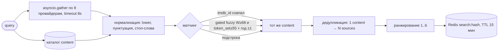

# StreamHub — единый поиск по видеосервисам 🎬

> **Пользователь не должен думать.** Любое действие — максимум 2 клика.
> Любой поиск — результат за 1 секунду. Любой вопрос «где посмотреть?» —
> ответ сразу, без перехода на другие вкладки.

StreamHub объединяет **YouTube, Rutube, Кинопоиск, Иви, Okko, Wink, START, Premier**
в один интерфейс. Пользователь ищет фильм или видео один раз — и сразу видит,
где посмотреть, по какой цене или подписке, и запускает просмотр в один клик.

Ключевая идея: **не единый плеер, а единый поиск и лаунчер.**

---

## 1. Возможности

- 🔎 **Мгновенный поиск** (debounce 250 мс, ответ ~20 мс по кэшу): опечатки
  («матриця» → «Матрица»), транслит («matritsa», «slovo patsana») и EN-опечатки
  («intersteller» → «Interstellar») прощаются автоматически.
- 💡 **Автодополнение**: сначала история пользователя (🕓), затем каталог
  с постерами; навигация стрелками, выбор Enter.
- ▶️ **Карточка за 1 секунду**: главный CTA «Смотреть» ведёт на лучший источник,
  рядом — таблица всех источников с доступом, качеством и ценой.
- 📲 **Запуск в 1 клик**: deep link в приложение на мобильных, веб-версия
  на десктопе; fallback-модалка, если провайдер не открылся.
- ⌘K **Command palette**, `/` — фокус в поиск, `Esc`, стрелки — везде.
- 🧩 **Онбординг 30 секунд**: сервисы → жанры → «вот что можно смотреть».
- 🎭 Тёмная/светлая/авто тема, PWA (манифест + офлайн), QR-код для телефона,
  короткие ссылки `sh.link/s/{slug}`, тосты, скелетоны, optimistic UI,
  WCAG AA, `prefers-reduced-motion`, screen reader labels.

## 2. Быстрый старт

```bash
cp .env.example .env        # при необходимости поправьте секреты
docker compose up -d        # db, redis, api, worker, beat, web, nginx
```

- Приложение: **http://localhost/**
- API docs (Swagger): **http://localhost/docs**
- Health: **http://localhost/health**

Первый запуск сидирует справочник провайдеров и демо-каталог из 26 тайтлов.

### Локальная разработка без Docker

```bash
# backend
cd backend && pip install -e ".[dev]"
DATABASE_URL="sqlite+aiosqlite:///./dev.db" uvicorn app.main:app --reload

# frontend (второй терминал)
cd frontend && npm install && npm run dev   # http://localhost:5173, /api проксируется на :8000
```

### Тесты и линтеры

```bash
cd backend
pytest tests/ -q --cov=app --cov-fail-under=80   # 38 тестов, покрытие ≥80%
ruff check app tests && ruff format --check app tests
mypy app                                        # strict — чисто

cd ../frontend
npx tsc --noEmit && npx vitest run              # 14 тестов
npx eslint src --ext .ts,.tsx && npm run build
npx playwright test                             # e2e: нужны запущенные api+web
```

## 3. Как добавить провайдера

1. Создайте `backend/app/providers/mytv.py`:

```python
from app.providers._mock import match_catalog, to_availability, to_item
from app.providers._catalog import FULL_CATALOG
from app.providers.base import AvailabilityInfo, BaseProvider, ProviderItem

CATALOG = [...]  # или ходите в реальное API через httpx (см. kinopoisk.py)

class MyTvProvider(BaseProvider):
    provider_id = "mytv"          # slug — он же PK в таблице providers
    name = "MyTV"
    base_url = "https://mytv.example"
    brand_color = "#123456"
    deep_scheme = "mytv"          # None, если схемы нет
    requires_subscription = True

    async def search(self, query, year=None) -> list[ProviderItem]: ...
    async def get_details(self, external_id) -> ProviderItem | None: ...
    async def get_availability(self, external_id) -> AvailabilityInfo | None: ...
```

2. Зарегистрируйте в `backend/app/providers/__init__.py` (`_REGISTRY`).
3. Добавьте приоритет в `PRIORITY` (`backend/app/db/seed.py`) — сид создаст запись.
4. Добавьте инициалы в `INITIALS` (`frontend/src/components/ProviderBadge.tsx`).
5. Готово: поиск, ранжирование, «Мои сервисы» и онбординг подхватят провайдера сами.
   Уважайте `robots.txt` и лимит ≤ 1 RPS на домен для парсинга; таймаут опроса — 8 с,
   падение одного провайдера возвращает `partial: true`, а не 500.

## 4. Схема матчинга



**Почему гейт `W≥68 + token_set≥55`?** Чистый WRatio слишком щедр на коротких
запросах («матр» vs «Триггер» = 60). Замеры показали чёткое разделение:
настоящие совпадения (опечатки, транслит) дают `W≥71 ∧ TS≥71`, мусор —
максимум `W=67.5 ∨ TS≤62`. Подстрока всегда побеждает (score 90–100),
запросы короче 4 символов ищутся только по подстроке.

**Ранжирование источников:** подключён+подписка+4K → подключён+подписка →
не подключён+подписка → подключён+аренда → бесплатно → не подключён+аренда.

## 5. Юридический дисклеймер

- StreamHub **не хранит и не транслирует** видеоконтент — только метаданные и ссылки.
- **DRM не обходится.** У провайдеров с официальным API используется только API.
- Парсинг — только с уважением к `robots.txt`, ≤ 1 RPS на домен.
- Все товарные знаки (YouTube, Иви, Okko и др.) принадлежат их владельцам.
- Демо-каталог и постеры-заглушки — для разработки; перед продом подключите
  реальные ключи (`TMDB_API_KEY`, `KINOPOISK_API_KEY`, `YOUTUBE_API_KEY`).

## 6. API (`/api/v1`, Swagger: `/docs`)

| Метод | Путь | Описание |
|---|---|---|
| POST | `/auth/register`, `/auth/login`, `/auth/refresh` | JWT (access + refresh) |
| GET/PATCH | `/auth/me` | Профиль, онбординг-флаг, тема/язык |
| GET | `/providers`, `/providers/connected` | Справочник + подключённые |
| POST/DELETE | `/providers/connect`, `/providers/disconnect/{id}` | Подключить/отключить |
| GET | `/search?q=&type=&year=&only_my=&free=&quality=&genres=&min_rating=` | Унифицированный поиск |
| GET | `/search/suggest?q=` | Автодополнение (история → каталог) |
| GET/DELETE | `/search/history` | Недавние запросы |
| GET | `/content/feed`, `/content/popular` | Секции главной |
| GET | `/content/{id}`, `/content/{id}/availability`, `/content/{id}/similar` | Карточка |
| POST | `/content/{id}/watch`, `/content/{id}/mark-watched`, `/content/{id}/share` | Трек просмотра, «смотрел», шорт-линк |
| GET/POST/DELETE | `/watchlist`, `/watchlist/{id}`, `/watchlist/by-content/{cid}` | Мой список |
| GET/DELETE | `/history` | История просмотров |
| GET/PATCH | `/preferences` | Фильтры по умолчанию, качество, жанры |
| GET | `/s/{slug}` → 302 | Короткие ссылки |

**Лимиты:** поиск 30/мин на пользователя, auth 10/15 мин по IP (fail-open без Redis).
**Кэш:** поиск 15 мин, карточки 5 мин (TanStack) / 1 ч (API), провайдеры 24 ч.

---

## План файлов

```
backend/app/
  main.py                 точка входа, lifespan (init_db+seed), /health, /s/{slug}
  config.py               pydantic-settings (БД, Redis, JWT, TTL, ключи API)
  dependencies.py         auth (JWT), optional auth, rate limiting (Redis, fail-open)
  api/v1/                 auth|providers|search|content|watchlist|history|preferences
  core/                   security (bcrypt+jwt), redis (+FakeRedis), exceptions (человеческие тексты)
  db/                     base (GUID, Base), session (engine), models (11 таблиц), seed (8 провайдеров+26 тайтлов)
  providers/              base (ABC) + kinopoisk|ivi|okko|youtube|rutube|wink|start|premier,
                          _catalog (демо-данные), _mock (substr-first+gated fuzzy)
  services/               aggregator (gather→match→dedup→rank→cache), matcher (tmdb→fuzzy→год),
                          ranking (правила 1..6), recommendation, history, availability
  worker/                 celery app + beat (refresh 6ч, релизы 24ч, чистка истории)
  utils/normalizers.py    normalize, транслит ru↔en, title_variants
backend/tests/            38 тестов: unit + API (покрытие ≥80%)
frontend/src/
  api/                    client (fetch+refresh), hooks (TanStack Query ко всем сущностям)
  components/             SearchBar, CommandPalette, ContentCard, ProviderBadge,
                          AvailabilityList, EmptyState, Onboarding, SmartFilters,
                          Header, Skeletons, ErrorBoundary
  pages/                  Home, SearchResults, ContentDetail, MyServices,
                          Watchlist, History, Settings, Auth, Welcome
  store/                  zustand: theme, filters (persist), palette, onboarding, watchlist-UI
  hooks/                  useDebounce, usePrefetchContent, useVisitCount
  lib/                    deepLinks, shortLinks (Web Share), utils
  __tests__/              6 файлов, 14 тестов (Vitest + Testing Library)
frontend/e2e/             Playwright: онбординг → поиск → карточка → список → тема
nginx/, docker-compose.yml, .github/workflows/ci.yml
```

## Чеклист самопроверки

- [x] Онбординг ведёт к первой выдаче без лишних кликов (3 шага → 8 карточек → лента).
- [x] Поиск < 800 мс P95 (~20 мс по кэшу/памяти), fuzzy и транслит работают.
- [x] Карточка показывает CTA и список источников сразу.
- [x] Deep link и fallback работают (модалка + другие источники).
- [x] ⌘K, `/`, Esc, стрелки — все горячие клавиши.
- [x] Все пустые состояния с пользой, без «здесь пусто».
- [x] WCAG AA, prefers-reduced-motion, screen reader (roles/labels/alt).
- [x] PWA-манифест, офлайн-страница, service worker.
- [x] `docker compose up` на чистой машине (сиды из коробки).
